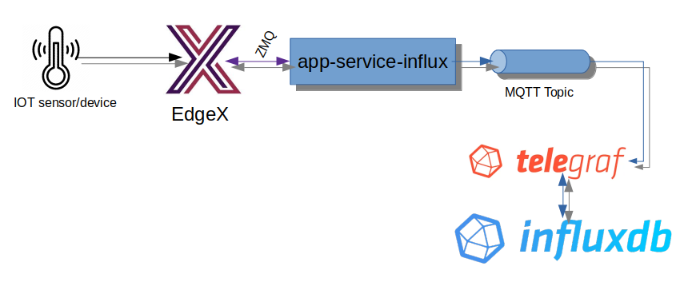

# Hanoi Demo

This demo shows the Hanoi release of EdgeX with the following devices:

- Comet Systems T0310 temperature probe (Modbus RTU)
- Patlite Signal Tower (SNMP)
- Moisture sensor

*The device services customizations are included with this demo.  See the original device service repositories (below) for updates to the device service code*

- [Device Service Modbus](https://github.com/edgexfoundry/device-modbus-go)
- [Device Service SNMP](https://github.com/edgexfoundry/device-snmp-go)
- [Device Service GPIO Moisture](https://github.com/jpwhitemn/device-gpio-moist-go)

It also demonstrates getting data to InfluxDB (via MQTT and Telegraf) for visual display.  This requires a custom application service to get export the EdgeX sensor data out into InfluxDB line protocol format and sent to an MQTT topic where it is picked up by Telegraf and inserted into InfluxDB.



*The custom application service code is available at the original repository below*

- [Application Service InfluxDB export](https://github.com/jpwhitemn/app-service-influx)

## Starting

To run the demo, perform the following operations:

1. Start Mosquitto Broker (mosquitto -c *your config path/file*)
2. Start InfluxDB and Telegraf
3. Start EdgeX (Hanoi) using Docker Compose (docker-compose up -d in the ./compose/ folder). This Compose file has been modified for this demo (removal of security protections and non-use device services)
4. Start the device services and app service running on the same host using the start.sh script in this directory
5. Start the moisture device service running on a Raspberry Pi 3
6. Configure the rules on a new install/start


To stop the demo, perform the following operations:
1. Stop the device services and application service
2. Stope EdgeX using Docker Compose (docker-compose down in the ./compose/ folder)
3. Optionally stop Mosquitto, Telegraf and InfluxDB

## Rules Setup

### Create the stream

Send the following POST to the Kuiper Rules Engine
192.168.0.35:48075/streams (with content type set to application/json)

``` JSON
	{
	  "sql": "create stream watches() WITH (FORMAT=\"JSON\", TYPE=\"edgex\")"
	}
```

### Create the rules to monitor the temperature probe and control the Patlite Red Light

**Create the rule to turn on the patlite**

Send the following POST to the Kuiper Rules Engine (replace command IDs as appropriate).

``` JSON

	{
	  "id": "probe-out-of-position",
	  "sql": "SELECT ProbeTemperature FROM watches WHERE ProbeTemperature < 900",
	  "actions": [
	    {
	      "rest": {
	        "url": "http://edgex-core-command:48082/api/v1/device/c4bfef8c-273f-414b-9481-c2ad5e801d15/command/66046772-d3e6-45b4-a267-bf71354a26c3",
	        "method": "put",
	        "retryInterval": -1,
	        "dataTemplate": "{\"RedLightControlState\":\"2\",\"RedLightTimer\":\"0\"}",
	        "sendSingle": true
	      }
	    },
	    {
	      "log":{}
	    }
	  ]
	}

```

**Create the rule to turn off the patlite**

Send the following POST to the Kuiper Rules Engine (replace command IDs as appropriate).

``` JSON
	{
	  "id": "probe-in-position",
	  "sql": "SELECT ProbeTemperature FROM watches WHERE ProbeTemperature >= 900",
	  "actions": [
	    {
	      "rest": {
	        "url": "http://edgex-core-command:48082/api/v1/device/c4bfef8c-273f-414b-9481-c2ad5e801d15/command/66046772-d3e6-45b4-a267-bf71354a26c3",
	        "method": "put",
	        "retryInterval": -1,
	        "dataTemplate": "{\"RedLightControlState\":\"1\",\"RedLightTimer\":\"0\"}",
	        "sendSingle": true
	      }
	    },
	    {
	      "log":{}
	    }
	  ]
	}
```

### Create the rules to monitor the moisture sensor and control the Patlite Amber (yellow) Light

**Create the rule to turn off the patlite**

Send the following POST to the Kuiper Rules Engine (replace command IDs as appropriate).

``` JSON
	{
	"id": "moisture-not-detected",
	"sql": "SELECT MoistureState FROM watches WHERE MoistureState < 1",
	"actions": [
		{
		"rest": {
			"url": "http://edgex-core-command:48082/api/v1/device/c4bfef8c-273f-414b-9481-c2ad5e801d15/command/f5f7b4ad-74ab-4f02-a341-e384646ae250",
			"method": "put",
			"retryInterval": -1,
			"dataTemplate": "{\"AmberLightControlState\":\"1\",\"AmberLightTimer\":\"0\"}",
			"sendSingle": true
		}
		},
		{
		"log":{}
		}
	]
	}
```

**Create the rule to turn on the patlite**

Send the following POST to the Kuiper Rules Engine (replace command IDs as appropriate).

``` JSON
	{
	"id": "moisture-detected",
	"sql": "SELECT MoistureState FROM watches WHERE MoistureState >= 1",
	"actions": [
		{
		"rest": {
			"url": "http://edgex-core-command:48082/api/v1/device/c4bfef8c-273f-414b-9481-c2ad5e801d15/command/f5f7b4ad-74ab-4f02-a341-e384646ae250",
			"method": "put",
			"retryInterval": -1,
			"dataTemplate": "{\"AmberLightControlState\":\"2\",\"AmberLightTimer\":\"0\"}",
			"sendSingle": true
		}
		},
		{
		"log":{}
		}
	]
	}
```

## Setup the export

Export to a Mosquitto Topic (in this case on another server).
1. Install Mosquitto
2. Configure Mosquitto to receive messages from off box (outside localhost)
	``` 
		# in a special edgex.conf in /etc/mosquitto/conf.d
		per_listener_settings true

		port 1883

		listener 1884
		allow_anonymous true
		#password_file /etc/mosquitto/conf.d/passwords.txt
	```
3. Add a passwords.txt to /etc/mosquitto/conf.d and use mosquitto's passwd encryption tool to encrypt
4. Add an application configuration service to the compose file (using MQTT Profile), and provide overrides to the standard configuration (values subject to your configuration/users/etc.)
``` yaml
		environment:
		BINDING_PUBLISHTOPIC: events
		CLIENTS_COMMAND_HOST: edgex-core-command
		CLIENTS_COREDATA_HOST: edgex-core-data
		CLIENTS_DATA_HOST: edgex-core-data
		CLIENTS_METADATA_HOST: edgex-core-metadata
		CLIENTS_NOTIFICATIONS_HOST: edgex-support-notifications
		CLIENTS_RULESENGINE_HOST: edgex-kuiper
		CLIENTS_SCHEDULER_HOST: edgex-support-scheduler
		CLIENTS_VIRTUALDEVICE_HOST: edgex-device-virtual
		DATABASES_PRIMARY_HOST: edgex-redis
		EDGEX_PROFILE: mqtt-export
		EDGEX_SECURITY_SECRET_STORE: "false"
		MESSAGEBUS_SUBSCRIBEHOST_HOST: edgex-core-data
		REGISTRY_HOST: edgex-core-consul
		SERVICE_HOST: edgex-app-service-configurable-mqtt
		SERVICE_PORT: 48101
		Writable_Pipeline_Functions_MQTTSend_Addressable_Address: 192.168.0.33
		Writable_Pipeline_Functions_MQTTSend_Addressable_Port: 1884
		Writable_Pipeline_Functions_MQTTSend_Addressable_Protocol: tcp
		Writable_Pipeline_Functions_MQTTSend_Addressable_Topic: edgex/EdgeXEvents
```

